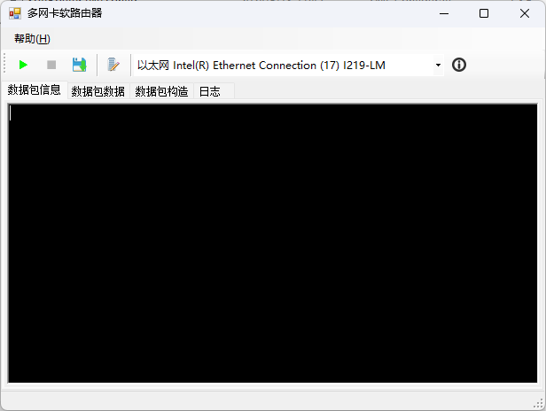
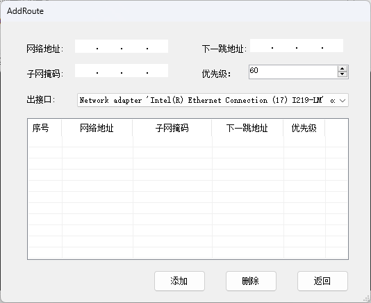

# SoftRouter 项目文档 #

----------

## 概述 ##

- Description：针对多网卡计算机的虚拟路由器功能软件
- SharpPcap版本：4.2
- WinPcap版本：4.1.2
- .net版本：.NET Framework 4
- Visual Studio版本：Visual Studio 2013 ULT

## 主要算法 ##

### 1. 抓包 ###

使用SharpPcap库提供的功能读取适配器信息，并监听适配器以及抓包。

### 2. 数据包处理 ###

将捕获的数据包依据目的IP地址，根据路由表信息，将数据包修改信息后由对应的网络设备进行转发，来实现基础的路由器功能。

## 程序结构 ##

- Program.cs：程序入口
- SoftRoute.cs：软路由描述类
- Device.cs：设备描述类，提供设备基础信息
- MacAddress.cs：提供MAC地址的获取
- RouteTable.cs：路由描述类，定义路由数据
- RouteTableList.cs：路由表描述类，定义路由表
- ListViewDoubleBuffer.cs：重载的LIstView类以使支持双缓冲

## \*tcpsoft的附注\* ##

- 需要安装winpcap，否则不能运行
- 需要.NET运行库，4.0版本或4.8版本
- 仅提供内网间或公网间的包转发，不提供NAT功能
- 该项目实现了Windows的路由表。这，这不就是Windows的route命令解决的事吗？好像写了一堆代码，但又没有什么新的作用。又不能提供NAT转换，只是包转发，不能做到路由器的功能，只是转发器。略显鸡肋。

运行效果：

